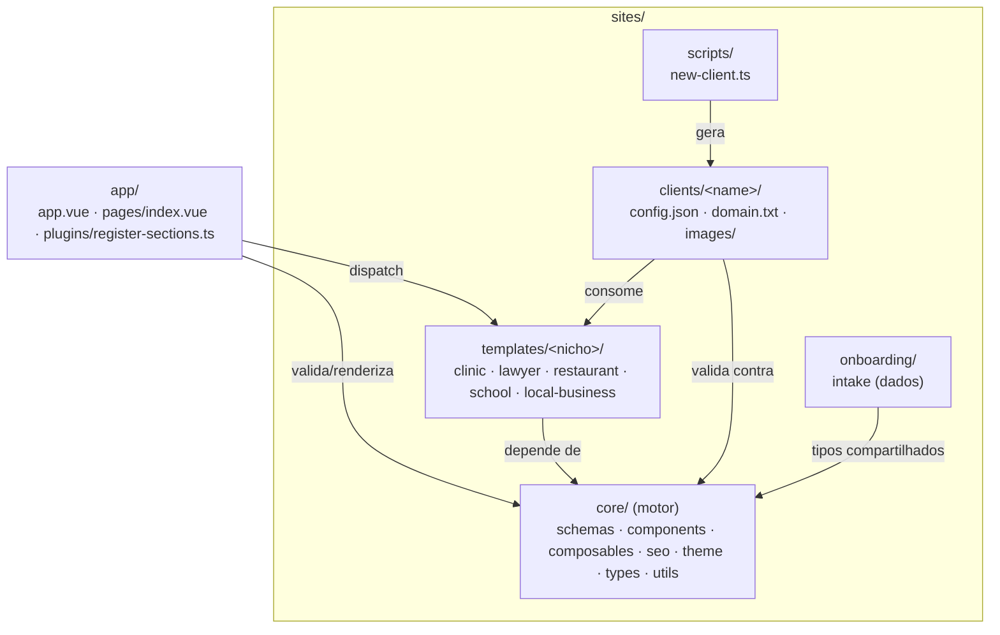
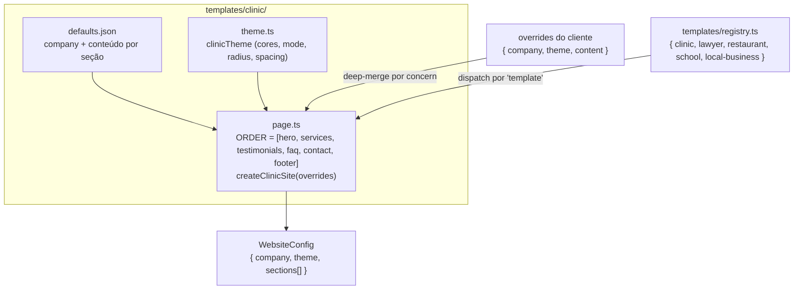

# Diagramas de arquitetura

> **Pré-requisitos**: [Arquitetura em camadas](./arquitetura-em-camadas.md).
> **Tema**: architecture

Diagramas em Mermaid (texto versionável, renderizado nativamente no GitHub).
Esta página reúne os diagramas de **estrutura de pastas** e de **composição de
templates** (FR-015). Os demais diagramas obrigatórios estão em:
[fluxo de renderização](../core/motor-de-renderizacao.md),
[fluxo de onboarding](../onboarding/fluxo-de-onboarding.md) e
[fluxo de deployment](../deployment/deploy.md).

## Estrutura de pastas (camadas)

Fonte: árvore real de `sites/` e `app/`



A regra-chave: setas só apontam **para baixo** rumo ao `core`. O `core` não aponta
para nenhuma camada acima (ver [arquitetura em camadas](./arquitetura-em-camadas.md)).

## Composição de templates

Fonte: `sites/templates/clinic/{page.ts,theme.ts,defaults.json}`, `sites/templates/registry.ts`

Um template = **ordem fixa de seções** (`page.ts`) + **tema** (`theme.ts`) +
**conteúdo padrão** (`defaults.json`), orquestrando seções reutilizáveis. A ordem
NÃO é sobrescrevível pelo cliente (Princípio VI).



`createClinicSite` mescla, por concern, defaults + overrides e fixa a ordem das
seções:

Fonte: `sites/templates/clinic/page.ts`

```ts
const ORDER = ['hero', 'services', 'testimonials', 'faq', 'contact', 'footer'] as const

export function createClinicSite(overrides: ClinicOverrides = {}): WebsiteConfig {
  return {
    company: { ...defaults.company, ...overrides.company },
    theme: { ...clinicTheme, ...overrides.theme },
    sections: ORDER.map((type) => ({
      type,
      ...defaultSections[type],
      ...(overrides.content?.[type] ?? {}),
    })),
  } as WebsiteConfig
}
```

## Próximos passos

- O fluxo de render em detalhe: [motor de renderização](../core/motor-de-renderizacao.md).
- A estratégia de template: [estratégia de nicho](../templates/estrategia-de-nicho.md).
- [Voltar ao índice de arquitetura](./README.md)
