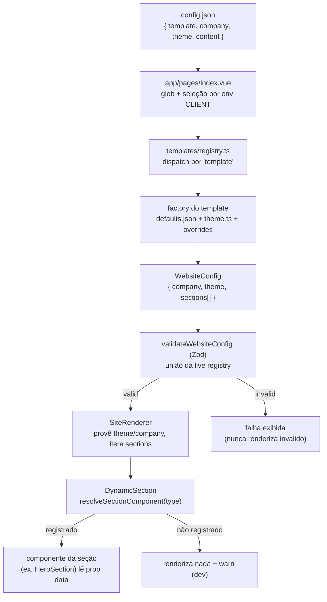

# Motor de renderização

> **Pré-requisitos**: [Core](./README.md), [Registries](./registries.md).
> **Tema**: core

Como o JSON guia a renderização: o `SiteRenderer` itera as seções e o
`DynamicSection` resolve cada `type` para um componente, com fallback seguro e
contenção de erro por seção (FR-009/FR-010).

## A cadeia canônica (config → DOM)

Fonte: `app/pages/index.vue`, `sites/templates/registry.ts`, `sites/core/schemas/validate-website.ts`, `sites/core/components/render/SiteRenderer.vue`, `sites/core/components/render/DynamicSection.vue`



> **Distinção crítica**: o `config.json` do cliente **não** é o `WebsiteConfig`
> final. É `{ template, company, theme, content }`; a factory do template o
> transforma em `{ company, theme, sections[] }`. Confundir os dois é fonte comum
> de erro — ver [config.json](../clients/config-json.md).

## SiteRenderer — o iterador da página

Fonte: `sites/core/components/render/SiteRenderer.vue`

Recebe um `WebsiteConfig` **já validado** (contrato de entrada R8 — não revalida),
provê `theme` e `company` ao subtree e itera as seções em **ordem de lista = ordem
de render**, com chave estável por item:

```vue
<script setup lang="ts">
useSiteTheme(props.config.theme)       // provê o tema a todas as seções
useSiteCompany(props.config.company)   // provê a identidade uma vez

function sectionKey(section, index) {
  const id = (section as { id?: string | number }).id
  return id ?? `${index}:${section.type}`   // hoje resolve por índice:type
}
</script>

<template>
  <DynamicSection
    v-for="(section, index) in config.sections"
    :key="sectionKey(section, index)"
    :section="section"
    :index="index"
  />
</template>
```

Lista vazia → página vazia (estado válido, R9). Não há reordenação.

## DynamicSection — resolução por `type`

Fonte: `sites/core/components/render/DynamicSection.vue`

Recebe **uma** seção, resolve o componente do seu `type` no registry de componente
(lookup O(1)) e o renderiza via `<component :is>` — sem `if/else` por tipo:

```vue
<script setup lang="ts">
const resolved = computed(() => resolveSectionComponent(props.section.type))
const failed = ref(false)

if (!resolved.value) warnMissing('no registered component')

onErrorCaptured(() => {
  failed.value = true
  warnMissing('section threw during render')
  return false  // contém o erro — irmãs não são afetadas
})
</script>

<template>
  <component :is="resolved" v-if="resolved && !failed" :data="section" />
  <!-- sem componente (ou erro contido) -> renderiza nada -->
</template>
```

A seção recebe seu slice como **único** prop `data`; o componente ignora `data.type`
e lê seus próprios campos.

## Comportamento de fallback e contenção de erro

Fonte: `sites/core/components/render/DynamicSection.vue`

- **`type` sem componente registrado** → renderiza **nada** + warning só em dev
  (nomeando o `type` e o índice). Nunca lança.
- **Seção lança em runtime** → `onErrorCaptured` retorna `false`, contendo o erro
  naquela seção; ela degrada para "renderiza nada", e as seções irmãs seguem
  renderizando.

Esse é o porquê de um `type` precisar dos **dois registries**: um `type` válido no
schema mas sem componente passa pela validação e cai no fallback "renderiza nada".
Ver [registries](./registries.md) e
[troubleshooting](../troubleshooting/problemas-comuns.md).

## Ciclo de vida da renderização

1. **Boot**: o plugin importa `register.ts`, populando os dois registries.
2. **Seleção**: `index.vue` escolhe o cliente (`CLIENT`) e despacha o template.
3. **Construção**: a factory monta o `WebsiteConfig`.
4. **Validação**: `validateWebsiteConfig` — só dados válidos passam adiante.
5. **Provisão**: `SiteRenderer` provê `theme`/`company`.
6. **Iteração**: para cada seção, `DynamicSection` resolve e monta o componente.
7. **Resiliência**: ausências e erros degradam por seção, sem derrubar a página.

## Próximos passos

- Como a validação rejeita o inválido: [schemas e validação](./schemas-e-validacao.md).
- O conceito dos dois registries: [registries](./registries.md).
- Quando algo não aparece: [troubleshooting](../troubleshooting/problemas-comuns.md).
- [Voltar ao índice de core](./README.md)
