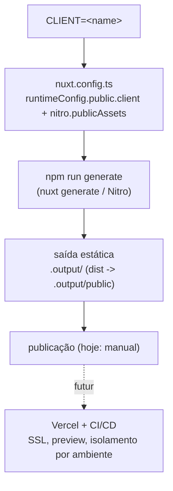

# Deploy

> **Pré-requisitos**: [Deployment](./README.md), [rodar em dev](../getting-started/rodar-em-dev.md).
> **Tema**: deployment

Como gerar o site para publicação. Hoje o build é **estático por cliente**; o deploy
automatizado é disciplina declarada na constituição, mas **ainda não implementado**.

## Hoje: um build estático por cliente

Fonte: `package.json`, `nuxt.config.ts`

```bash
CLIENT=<name> npm run generate   # gera o site estático do cliente <name>
CLIENT=<name> npm run build      # build server/SSR
CLIENT=<name> npm run preview    # pré-visualiza o build
```

O alvo é selecionado pela env `CLIENT` (default `clinica-saude`). Um build = um
cliente; as imagens do cliente são servidas de `/clients/<name>/images/` via Nitro.



Scripts disponíveis:

Fonte: `package.json`

```json
"scripts": {
  "build": "nuxt build",
  "generate": "nuxt generate",
  "preview": "nuxt preview"
}
```

## Futuro: deploy automatizado

Fonte: `.specify/memory/constitution.md` (Princípio XIII)

A constituição define a estratégia-alvo (ainda não implementada):

```text
Deployments MUST be automated, reproducible, fast, and low-maintenance. The preferred
strategy is Vercel with automatic SSL, CI/CD pipelines, preview deployments, and
environment isolation.
```

Isso significa: um pipeline que, por cliente, roda `generate` com o `CLIENT` certo e
publica, com preview por PR e SSL automático. A doc marca isso como **futuro** para
não prometer comportamento inexistente.

## Próximos passos

- Como o pipeline se encaixa: [como o deployment funciona](../guides/como-funciona-deploy.md).
- Domínios por cliente: [configurar domínios](../guides/configurar-dominios.md).
- Visão completa: [escala futura](../standards/escala-futura.md).
- [Voltar ao índice de deployment](./README.md)
