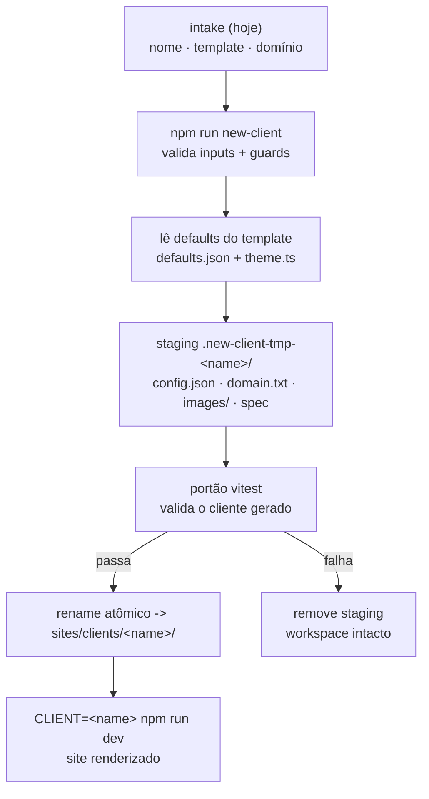
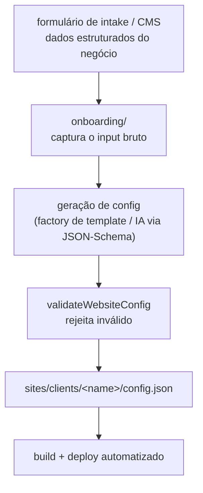

# Fluxo de onboarding

> **Pré-requisitos**: [Onboarding](./README.md),
> [criar um novo cliente](../guides/criar-novo-cliente.md).
> **Tema**: onboarding

Como os dados de um cliente novo viram um site. Distingue **hoje** (scaffold por
comando) de **futuro** (intake estruturado / IA).

## Hoje: scaffold por comando

Fonte: `sites/scripts/new-client.ts`, `sites/onboarding/README.md`

Hoje o "onboarding" é coletar três entradas (nome, template, domínio) e rodar o
scaffold, que monta a pasta do cliente a partir dos defaults do template. A camada
`sites/onboarding/` guarda a responsabilidade de intake; os dados ainda são
fornecidos direto ao comando.

## Futuro: intake estruturado e IA

Fonte: `sites/onboarding/README.md`, `.specify/memory/constitution.md` (Princípios IV, XV)

A ponte do futuro reusa exatamente as mesmas peças de hoje: dado → factory →
`validateWebsiteConfig` → cliente. Só a **fonte** do dado muda (formulário/IA em vez
de prompt no terminal). Ver [escala futura](../standards/escala-futura.md).

## Próximos passos

- O guia operacional: [como o fluxo de onboarding funciona](../guides/como-funciona-onboarding.md).
- Crie um cliente agora: [criar um novo cliente](../guides/criar-novo-cliente.md).
- [Voltar ao índice de onboarding](./README.md)
