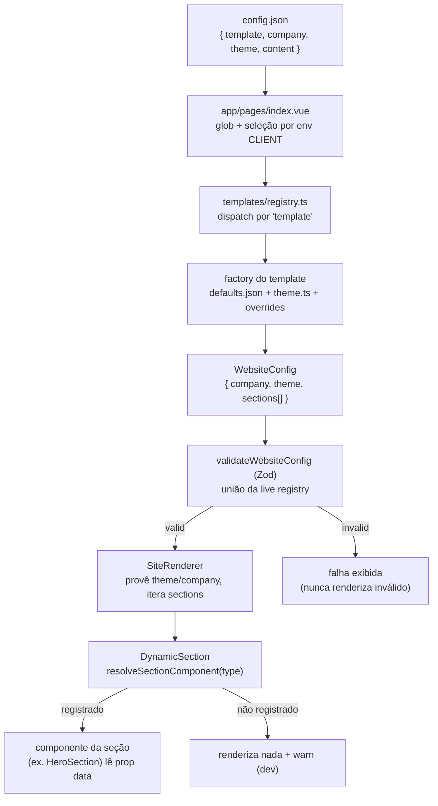

# Quickstart — Como navegar e contribuir com a documentação

**Feature**: 009-developer-docs-system | **Date**: 2026-06-06

Guia rápido para quem vai **escrever** ou **revisar** a documentação desta
feature (não confundir com o `docs/getting-started/`, que é para quem vai USAR a
plataforma).

## 1. Onde a documentação vive

Toda a doc fica em `docs/` na raiz do repo, com 11 subpastas temáticas
(ver `contracts/docs-structure-contract.md`). Markdown puro + diagramas Mermaid.

## 2. Para criar um documento novo

1. Copie `docs/_templates/documento-modelo.md`.
2. Coloque-o na subpasta temática correta (ver tabela de camadas em
   `data-model.md`).
3. Preencha o esqueleto: H1, pré-requisitos, conteúdo, **Próximos passos**.
4. Para todo snippet, cite a fonte real (`Fonte: <caminho>`); nada inventado
   (FR-021).
5. Linke o novo doc a partir do `README.md` da sua subpasta.

## 3. Para criar um Guia How-To

Use a variante de Guia do template. Obrigatórias, nesta ordem: **Explicação →
Localização dos arquivos → Exemplo prático → Convenções esperadas → Erros
comuns → Próximos passos** (FR-008). Os 13 guias exigidos estão listados no
contrato de estrutura.

## 4. Fontes da verdade (não duplicar regras — apontar)

Ao documentar comportamento, referencie o código que o define:

| Tema | Arquivo |
|------|---------|
| Shape do site (`WebsiteConfig`) | `sites/core/schemas/website.ts` |
| União/registro de seções (schema) | `sites/core/schemas/section.ts` |
| Validação whole-site | `sites/core/schemas/validate-website.ts` |
| Registro de componente | `sites/core/components/sections/registry.ts` |
| Iteração da página | `sites/core/components/render/SiteRenderer.vue` |
| Resolução por `type` + fallback | `sites/core/components/render/DynamicSection.vue` |
| Registro dos 8 blocos (boot) | `sites/core/components/sections/register.ts` |
| Seleção cliente/template | `app/pages/index.vue` |
| Template de nicho | `sites/templates/clinic/{page.ts,theme.ts,defaults.json}` |
| Config de cliente | `sites/clients/clinica-saude/config.json` |
| Scaffold | `sites/scripts/new-client.ts` |

## 5. A cadeia canônica (memorize)



## 6. Regra de ouro: "dois registries"

Um `type` de seção só funciona quando registrado nos DOIS lugares em
`register.ts`:

```ts
// Fonte: sites/core/components/sections/register.ts
registerSection(defineSection('hero', heroSchema))   // validável (schema)
registerSectionComponent('hero', HeroSection)        // renderável (componente)
```

Esquecer um lado é a causa nº 1 de "config inválido" (faltou schema) ou "seção
não renderiza" (faltou componente). Todo guia de seção e a doc de
troubleshooting devem martelar isso.

## 7. Checklist antes de commitar um doc

- [ ] Um H1, bloco de pré-requisitos, "Próximos passos" com ≥1 link.
- [ ] Todo snippet tem `Fonte: <caminho real>` e o caminho existe.
- [ ] PT-BR; termos técnicos explicados na 1ª ocorrência.
- [ ] Linkado a partir do README da subpasta.
- [ ] Se for guia: as 5 seções obrigatórias presentes e em ordem.

## 8. Como validar a entrega

Sem testes automatizados (é conteúdo). Validação por inspeção contra
SC-001..008 da spec e os critérios CT-1..CT-10 do contrato de estrutura. Um
revisor "frio" (sem contexto prévio) deve conseguir rodar o projeto e criar um
cliente seguindo só o `docs/getting-started/`.

## Próximos passos

- Gerar tarefas: `/speckit-tasks`
- Revisar contratos: `contracts/docs-structure-contract.md`,
  `contracts/doc-template-contract.md`
- Modelo de conteúdo: `data-model.md`
